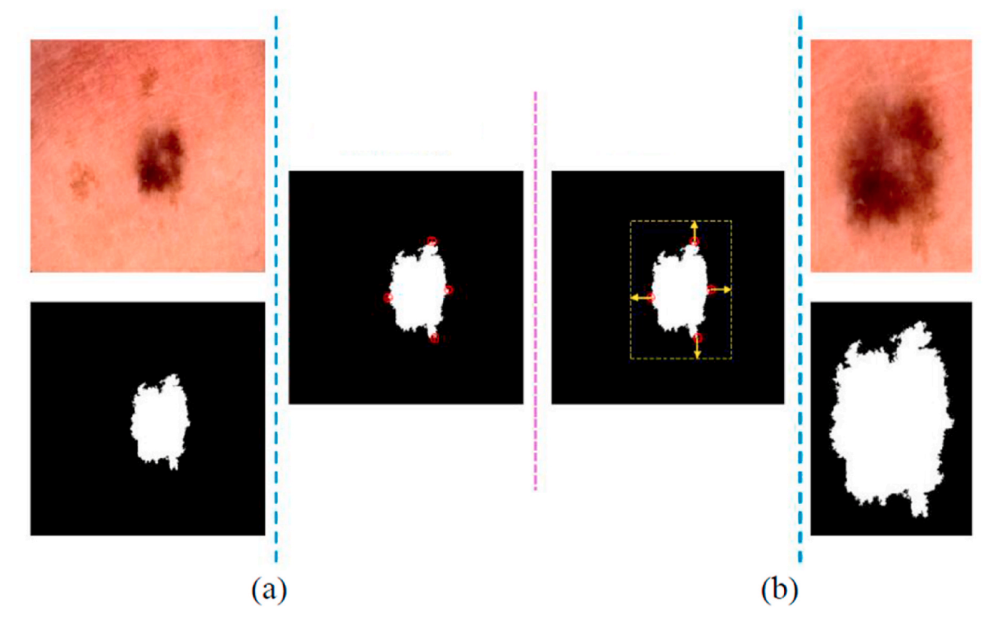

# Sampling Method Description
This repository contains the implementation of a novel sampling method utilized in our paper titled "A deep ensemble medical image segmentation with novel sampling method and loss function." This method was developed to address the challenge of imbalanced classes in medical image segmentation tasks.

## Overview:
In the pursuit of accurate medical image segmentation, particularly in scenarios with imbalanced class distributions, a novel sampling method was devised. This approach aims to prioritize pixels within lesion areas (such as tumors, cysts, or polyps) over background regions, thereby enhancing the model's ability to delineate important anatomical structures.

## Key Components:
Imbalance Ratio (IR) Calculation: The method computes the imbalance ratio for each image in the dataset. This ratio, derived from the division of pixels in the lesion region by those in the background, serves as a criterion for image selection.

Threshold Determination: A threshold for the imbalance ratio is set based on dataset characteristics, determined through iterative experimentation. Only images surpassing this threshold are deemed suitable for sampling.

Precise Sampling: Upon selecting images meeting the threshold criteria, the sampling process begins. Lesion boundaries are identified by analyzing ground truth masks, establishing edges in all directions (top, bottom, left, and right).

Inclusion of Surrounding Regions: A critical aspect involves including a region surrounding the lesion for training. This comprehensive approach ensures a balanced understanding of both lesion and background characteristics, mitigating model bias and enhancing segmentation performance.

Margin Addition: To capture contextual information, a margin is added around the lesion region. This facilitates a more nuanced analysis of image features, contributing to precise segmentation outcomes.

Data Generation: Finally, the selected area is cropped to generate training data, facilitating the creation of a more representative dataset tailored to the unique characteristics of the images.

## Purpose:
By integrating this sampling method into the dataset creation process, we aim to enhance the accuracy and reliability of subsequent segmentation models. This approach enables a more nuanced understanding of image features, particularly within lesion areas, leading to improved diagnostic capabilities in medical imaging applications.

## Acknowledgment:
We acknowledge the contributions of all authors involved in the development and validation of this sampling method, as detailed in the referenced paper.

For more information on the methodology and results, please refer to the [Paper](https://www.sciencedirect.com/science/article/abs/pii/S0010482524003895)
